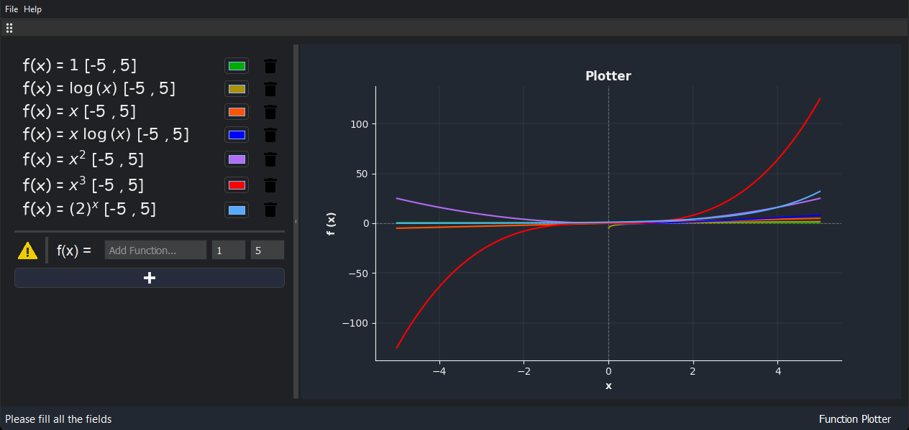
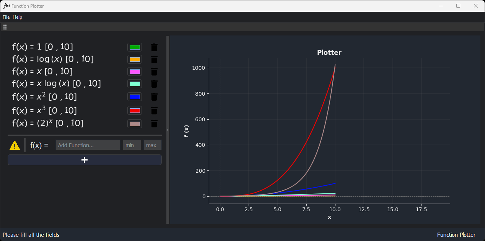
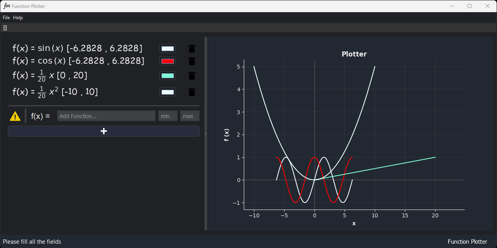
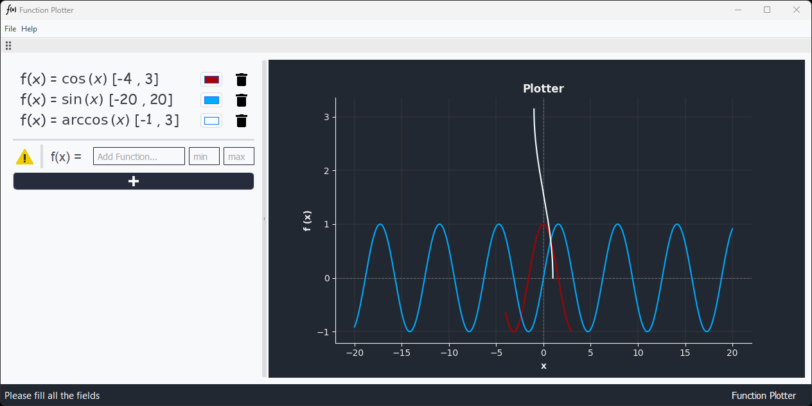

# Function Plotter


> Function plotter program that plots an arbitrary user-entered function.

---

### Table of Contents

- [Description](#description)
- [How To Use](#how-to-use)
- [Preview](#preview)
- [References](#references)

---

## Description

#### Features

- Plot an arbitrary user-entered function.
- Zoom in and out of the plot.
- Save the plot as an image.
- Change the color of the plot.
- input validation and error handling.
- Plot multiple functions at once.

#### Technologies

- Python
- Matplotlib
- Numpy
- PySide2

[Back To The Top](#function-plotter)

---

## How To Use

#### Installation

```Terminal
$ pip install -r requirements.txt
```

#### Run Locally
Run python3 main.py in the terminal.
```Terminal
$ python3 main.py
```

[Back To The Top](#function-plotter)

---

## Preview









[Back To The Top](#function-plotter)

---

## References

- [Matplotlib](https://matplotlib.org/)
- [Numpy](https://numpy.org/)
- [PySide2](https://pypi.org/project/PySide2/)
- [Python](https://www.python.org/)
- [Convert matplotlib Figure to QPixmap @Jean-Sébastien](https://stackoverflow.com/questions/32035251/displaying-latex-in-pyqt-pyside-qtablewidget)
- [How to render Latex markup using Python? @Wojciech Moszczyński](https://stackoverflow.com/questions/4028267/how-to-render-latex-markup-using-python)
- [Converting a Python numeric expression to LaTeX @Geoff Reedy](https://stackoverflow.com/questions/1841084/https://stackoverflow.com/questions/3867028/converting-a-python-numeric-expression-to-latex)

[Back To The Top](#function-plotter)

---
